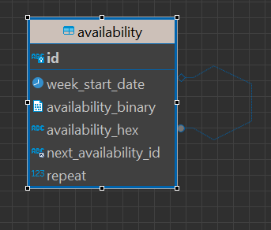

# Availability Scheduling Schema

This repository contains the schema for an event scheduling system where events can reference each other as parent or child events.

## Description

The `availability` table manages availability time with linked list structure in sql. Result in a much better performance in storage, access, modification and comparison.

## Column exmpalin:
  `id` (uuid): Primary key. \
  `week_start_date` (date): Start date of the week. Only needed for the first week of the sequence. \
  `availability_binary` (binary(42)): An binary number with 336 digits, each digits represent availability of an 30 minutes interval throughout the week. \
  `availability_hex`( char(84)): hex version of `availability_binary`. \
  `next_availability_id` (uuid): Used to indicating the next week's availability. Null if this is the end of sequence. \
  `repeat`( int(10) unsigned ): Number or week this avaiability repeat itself before move to the next avaiability or quit the sequence.